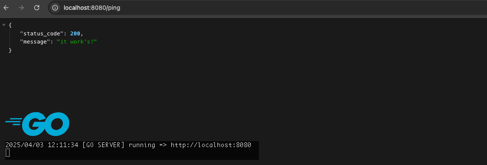

# go-miniserver



A simple go server build with the `net/http` package

## Quick Links
| Link | Description | Credential |
|------|-------------|------------|
|http://localhost:8080 | Local development | - |
|[Link](https://github.com/joho/godotenv) | Go Pkg. for loading env files | joho/godotenv |


## Development
### Overview and local setup
This Go project is structured as follows:

```
├── go-miniserver
│   ├── bin
│   │   └── *                     # Compiled binary goes here after build
│   ├── cmd
│   │   └── api
│   │        ├── main.go          # Entry point of the application
│   │        ├── router.go        # Router setup using net/http
│   │        └── middlewares.go   # Custom middleware definitions
│   ├── internal
│   │   └── handlers
│   │        ├── handlers.go      # Route handler wiring
│   │        └── healthcheck.go   # Healthcheck endpoint logic
│   └── .env                      # Environment variables for local dev
```

**Note:** 
This project uses the standard Go `net/http` package for HTTP routing.
All routes and middleware are defined in `/cmd/api`, and actual handler logic is encapsulated in `/internal/handlers`.

### First time initialisation
As soon as the project has been checked out from the Git repository, all required packages must be installed locally. Start in the root directory of your project:

```
# Install the Go packages
$ go mod tidy
```

### Run the Go Miniserver

```
# Start the server 
$ go run ./cmd/api/*.go

# Alternatively, create build
$ go build -o /bin/main ./cmd/api/*.go
```

## Call the Go Miniserver
### Local Maschine
You should see the following debug output in your terminal:

```
2025/04/03 12:00:15 [GO SERVER] running => http://localhost:8080
```
Open a browser of your choice and enter the following URL:
```
http://localhost:8080/ping
```
You should then see the following debug output on your terminal:
```
{
  "status_code": 200,
  "message": "it work's!"
}
```
and additionally you should get the following debug output on your terminal:
```
2025/04/03 12:01:58 [12:01:58] GET [::1]:12345
```

## Documentation
### For further information 

On my website you will find all further information under the appropriate heading.

To the official: [Documentation](https://github.com/joho/godotenv)